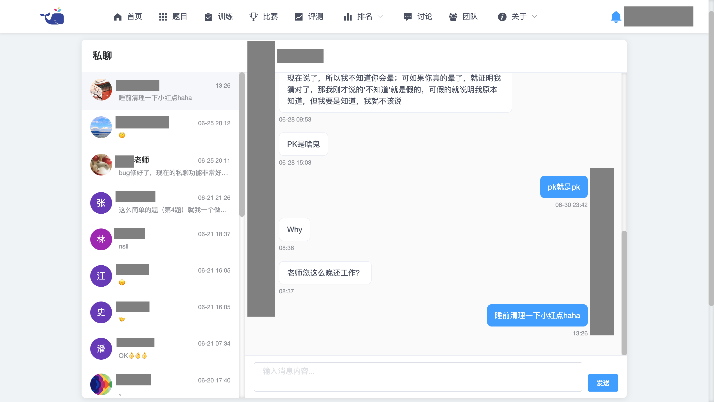
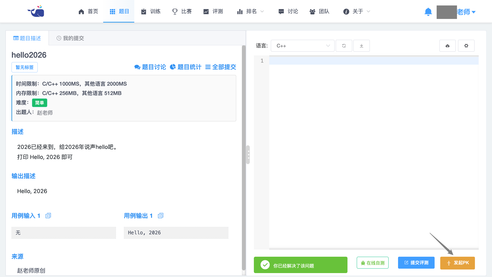
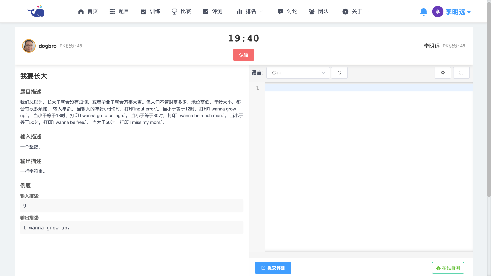
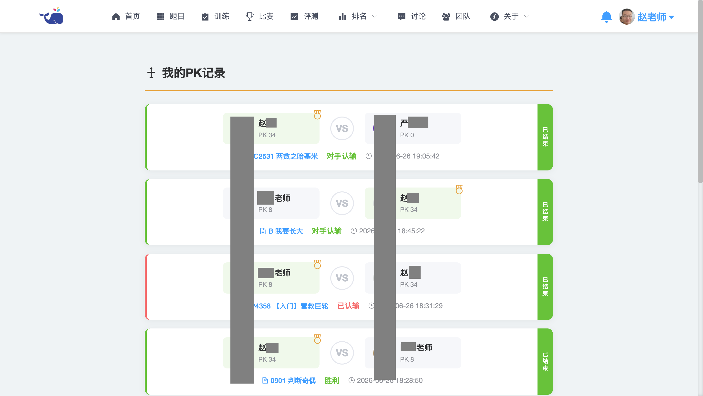

# Hcode Online Judge（HOJ）

> **JXXOJ** — 基于 [HimitZH/HOJ](https://github.com/HimitZH/HOJ) 的二次开发（Fork）版本，由 [lzdogbro](https://github.com/lzdogbro) 维护。


[](http://openjdk.java.net/)
[](https://spring.io/projects/spring-boot)
[](https://spring.io/projects/spring-cloud-alibaba)
[](https://www.mysql.com/)
[](https://redis.io/)
[](https://github.com/alibaba/nacos)
[](https://cn.vuejs.org/)
[](https://github.com/HimitZH/HOJ)
[](https://gitee.com/himitzh0730/hoj)
[](https://qm.qq.com/cgi-bin/qm/qr?k=WWGBZ5gfDiBZOcpNvM8xnZTfUq7BT4Rs&jump_from=webapi)

简体中文 | [English](./README-EN.md)

## 一、项目简介

HOJ 是一个基于 Vue 和 Spring Boot、Spring Cloud Alibaba 构建的**前后端分离、分布式架构**的在线评测系统（Online Judge）。

本项目（JXXOJ）是 HOJ 的 **Fork 二次开发版本**，由 [lzdogbro](https://github.com/lzdogbro) 在原版 [HimitZH/HOJ](https://github.com/HimitZH/HOJ) 的基础上进行功能增强与维护。在保留原版所有功能的同时，新增了 PK 对战、私聊系统等特色功能，并进行了多项优化与问题修复。

### 核心特性

**原版功能：**
- **多语言支持**：支持 C、C++、C#、Python、PyPy、Go、Java、JavaScript、PHP、Ruby、Rust 等多种编程语言的评测
- **Remote Judge（远程评测）**：支持 HDU、POJ、Codeforces（含 GYM）、AtCoder、SPOJ、LIBRE 的远程评测
- **多端适配**：支持 PC 端和移动端浏览，拥有讨论区与站内消息系统
- **训练 & 团队**：支持私有训练、公开训练（题单）和团队协作功能
- **丰富的评测模式**：普通测评、特殊测评（SPJ）、交互测评、在线自测、子任务分组评测、文件 IO
- **完善的比赛系统**：支持 ACM/OI 赛制，支持打星队伍、关注队伍、外榜、滚榜等功能

**二次开发新增：**
- **⚡ PK 对战**：实时 1v1 编程对战，积分排名系统，支持邀请、倒计时、认输、对战历史
- **💬 私聊系统**：用户间一对一私信交流，联系人列表，未读消息提醒
- **🚀 一键部署脚本**：自定义 `deploy.sh`，支持构建 → 打包 → 部署全流程自动化
- **🌐 多语言扩展**：新增繁体中文（zh-TW）、日语（ja-JP）、韩语（ko-KR）国际化支持
- **🐳 CDN 迁移**：静态资源 CDN 迁移至 Cloudflare / jsdelivr，提升国内访问速度
- **🐛 Bug 修复**：修复 Redis 分布式锁问题、PK 对战死锁等关键 bug
- **🎨 品牌更新**：JXXOJ 品牌标识，鲸小小图标替换，关于页面更新

|               在线 Demo               |                   在线文档                   |            仓库地址             |           QQ 群           |
| :--------------------------------: | :--------------------------------------: | :--------------------------------------: | :---------------------: |
| [https://hdoi.cn](https://hdoi.cn) | [https://docs.hdoi.cn](https://docs.hdoi.cn) | [GitHub](https://github.com/HimitZH/HOJ)  ·  [Gitee](https://gitee.com/himitzh0730/hoj) | 598587305（已满） · 743568562 |

### 注意事项

1. **建议使用 CentOS 8 以上或 Ubuntu 16.04 以上的操作系统**，否则判题机（JudgeServer）可能无法正常启动。
2. **若必须使用 CentOS 7 系统**，部署前请先阅读文档说明：[https://docs.hdoi.cn/deploy/faq/](https://docs.hdoi.cn/deploy/faq/)
3. **服务器配置建议 2 核 4G 以上**，以保证服务的正常启动与运行。
4. **尽量避免使用突发性能或共享型云服务器实例**，可能造成评测时间计量不准确。
5. 有任何部署问题或项目 bug 请发 issue 或者加 QQ 群。
6. 如果要对本项目进行商业化，请在页面底部的 Powered by 指向 HOJ 本仓库地址，顺便点个 star 收藏本项目，谢谢支持。

---

## 二、快速部署

### 方式一：使用 deploy.sh 一键部署（推荐）

项目根目录下的 `deploy.sh` 脚本可以完成**构建 → 打包 → 部署**的全流程。

```bash
# 首次部署（初始化部署目录）
./deploy.sh init

# 一键构建 + 部署（最常用）
./deploy.sh deploy

# 仅构建（后端 JAR + 前端 dist）
./deploy.sh build

# 仅同步构建产物到 myhoj-deploy
./deploy.sh sync

# 仅重启容器
./deploy.sh restart

# 查看容器状态
./deploy.sh status
```

**完整流程说明**：

```bash
# 1. 初始化 myhoj-deploy 目录（含 docker-compose.yml、Dockerfile、nginx 配置等）
./deploy.sh init

# 2. 构建后端 JAR
#    cd hoj-springboot && mvn package -DskipTests -q

# 3. 构建前端 dist
#    cd hoj-vue && NODE_OPTIONS=--openssl-legacy-provider npm run build

# 4. 复制构建产物到 myhoj-deploy
#    - hoj-backend-4.6.jar  → src/backend/
#    - dist/*               → src/frontend/html/
#    - hoj-scrollBoard/*    → src/frontend/scrollBoard/
#    - hoj.sql              → src/mysql/

# 5. 停止旧容器 + 重新构建镜像 + 启动
#    docker-compose down && docker-compose up -d --build
./deploy.sh deploy
```

**关键端口**：

| 服务 | 端口 |
|------|------|
| 前端 Nginx | 8003 |
| 后端 API | 6688 |
| MySQL | 3391 |
| Redis | 6380 |
| Nacos | 8849 |

**环境变量**（可选配置）：

```bash
export MYHOJ_DEPLOY_DIR=/path/to/myhoj-deploy  # 部署目录路径（默认: ../myhoj-deploy）
export BACKEND_JAR_NAME=hoj-backend-4.6.jar    # 后端 JAR 文件名
```

### 方式二：基于原生 hoj-deploy 部署

部署文档：[https://docs.hdoi.cn/deploy/docker](https://docs.hdoi.cn/deploy/docker)

部署仓库：[https://gitee.com/himitzh0730/hoj-deploy](https://gitee.com/himitzh0730/hoj-deploy)

> ⚠️ **注意**：原生 hoj-deploy 使用官方 Docker 镜像，不包含私聊、PK 对战等二开功能。如需使用二开版本，请使用方式一中的 `deploy.sh`。

---

## 三、二次开发新增功能详情

### PK 对战（1v1 实时编程对战）

两个用户在同一道题目上进行限时编程对战（20 分钟），先通过评测（AC）者获胜。支持：

- **快速邀请**：在题目页面邀请其他用户进行 PK 对战
- **实时对战页**：左右分屏，左侧题目描述，右侧在线编辑器，顶部实时倒计时
- **积分系统**：胜者 +10 分，败者 -2 分，平局积分不变，积分展示在用户主页
- **历史记录**：查看个人所有 PK 对战历史，包括胜负详情和积分变化
- **计时与超时**：20 分钟倒计时，超时自动判为平局
- **认输机制**：支持主动认输，实时结束对战

### 私聊系统（用户间即时通讯）

用户之间可以进行一对一私信交流，与站内消息系统互补。支持：

- **联系人列表**：自动显示曾有过对话的用户，展示最后一条消息和未读计数
- **实时消息**：发送和接收私聊消息，通过轮询自动刷新
- **未读提醒**：导航栏实时显示未读私聊消息数量
- **便捷入口**：可在用户主页直接发起私聊

> 📌 **提示**：升级到包含 PK 和私聊功能的版本需要执行 SQL 变更（新增 `pk_match` 和 `private_chat` 表，以及 `user_record` 表的 `pk_score` 字段），详见 `sqlAndsetting/hoj.sql`。

---

## 四、项目结构

```
HOJ/
├── hoj-springboot/          # 后端 Spring Boot 微服务
│   ├── api/                 # 公共 API 模块（实体类、通用工具）
│   ├── DataBackup/          # 核心业务模块（数据服务）
│   └── JudgeServer/         # 判题服务（沙箱评测）
├── hoj-vue/                 # 前端 Vue 项目
├── hoj-scrollBoard/         # 滚榜独立页面
├── sqlAndsetting/           # 数据库脚本与配置文件
├── docs/                    # 文档源文件
└── sandbox/                 # 判题沙箱相关
```

---

## 五、更新日志

| 时间         | 内容                                       | 更新者           |
| ---------- | ---------------------------------------- | ------------- |
| 2020-10-26 | 正式开发                                     | Himit_ZH      |
| 2021-04-10 | 首次上线测试                                   | Himit_ZH      |
| 2021-04-15 | 判题调度 2.0 解决并发问题                            | Himit_ZH      |
| 2021-04-16 | 重构解耦 JudgeServer 判题逻辑，添加部署文档               | Himit_ZH      |
| 2021-04-19 | 加入 rsync 实现评测数据同步，修复一些已知的 BUG               | Himit_ZH      |
| 2021-04-24 | 加入题目模板，修改页面页脚                            | Himit_ZH      |
| 2021-05-02 | 修复比赛后管理员重判题目导致排行榜失效的问题                   | Himit_ZH      |
| 2021-05-09 | 添加公共讨论区，题目讨论区，比赛评论                       | Himit_ZH      |
| 2021-05-12 | 添加评论及回复删除，讨论举报，调整显示时间                    | Himit_ZH      |
| 2021-05-16 | 完善权限控制，讨论管理员管理，讨论删除与编辑更新                 | Himit_ZH      |
| 2021-05-22 | 更新 docker-compose 一键部署，修正部分 bug             | Himit_ZH      |
| 2021-05-24 | 判题调度乐观锁改为悲观锁                             | Himit_ZH      |
| 2021-05-28 | 增加导入导出题目，增加用户页面的最近登录，开发正式结束             | Himit_ZH      |
| 2021-06-02 | 大更新，完善补充前端页面，修正判题等待超时时间，修补一系列 bug         | Himit_ZH      |
| 2021-06-07 | 修正特殊判题，增加前台 i18n                          | Himit_ZH      |
| 2021-06-08 | 添加后台 i18n，路由懒加载                           | Himit_ZH      |
| 2021-06-12 | 完善比赛赛制，具体请看在线文档                          | Himit_ZH      |
| 2021-06-14 | 完善后台管理员权限控制，恢复 CF 的 vjudge 判题                | Himit_ZH      |
| 2021-06-25 | 丰富前端操作，增加 POJ 的 vjudge 判题                    | Himit_ZH      |
| 2021-08-14 | 增加 SPJ 对 testlib 的支持                       | Himit_ZH      |
| 2021-09-21 | 增加比赛打印功能、账号限制功能                          | Himit_ZH      |
| 2021-10-05 | 增加站内消息系统——评论、回复、点赞、系统通知的消息，优化前端          | Himit_ZH      |
| 2021-10-06 | 美化比赛排行榜，增加对 FPS 题目导入的支持                    | Himit_ZH      |
| 2021-12-09 | 美化比赛排行榜，增加外榜、打星队伍、关注队伍的支持                | Himit_ZH      |
| 2022-01-01 | 增加公开训练和公开训练（题单）                          | Himit_ZH      |
| 2022-01-04 | 增加交互判题、重构 JudgeServer 的三种判题模式（普通、特殊、交互）    | Himit_ZH      |
| 2022-01-29 | 重构 Remote Judge，增加 AtCoder、SPOJ 的支持         | Himit_ZH      |
| 2022-02-19 | 修改首页前端布局和题目列表页                           | Himit_ZH      |
| 2022-02-25 | 支持 PyPy2、PyPy3、JavaScript V8、JavaScript Node、PHP | Himit_ZH      |
| 2022-03-12 | 后端接口全部重构，赛外榜单增加缓存                        | Himit_ZH      |
| 2022-03-28 | 合并冷蕴提交的团队功能                              | Himit_ZH、冷蕴   |
| 2022-04-01 | 正式上线团队功能                                 | Himit_ZH、冷蕴   |
| 2022-05-29 | 增加在线调试、个人主页提交热力图                         | Himit_ZH      |
| 2022-08-06 | 增加题目标签的分类管理（二级标签）                        | Himit_ZH      |
| 2022-08-21 | 增加人工评测、取消评测                              | Himit_ZH      |
| 2022-08-30 | 增加 OI 题目的 subtask、ACM 题目的'遇错止评'模式            | Himit_ZH      |
| 2022-10-04 | 增加比赛奖项配置，增加 ACM 赛制的滚榜                      | Himit_ZH      |
| 2022-11-14 | 增加题目详情页专注模式，优化首页布局                       | Himit_ZH      |
| 2023-05-01 | 增加题目评测支持文件 IO                             | Himit_ZH      |
| 2023-06-11 | 增加允许比赛结束后提交                              | Himit_ZH      |
| 2023-06-27 | 支持 Ruby、Rust                              | Himit_ZH      |
| 2024-03-13 | 支持 LibreOJ 的远程评测                           | Himit_ZH、Nine |
| 2025-06-25 | 增加实名认证相关的邮件发送功能                           |             |
| 2026-06-03 | **Fork到JXXOJ**：对HOJ进行二次开发                     |  lzdogbro   |
| 2026-06-10 | **新增私聊功能**：用户间一对一私信交流，联系人列表，未读消息提醒       |  lzdogbro   |
| 2026-06-18 | **新增 PK 对战功能**：1v1 实时编程对战，限时 20 分钟，积分排名系统   |  lzdogbro   |

---

## 六、部分截图

**以下截图页面均支持中英文国际化，点击底部的转换即可全网站切换，包括后台管理，同时浏览器会记住本次选择的语言。**

### 1. 首页

> 首页页面


> 首页英文


### 2. 站内消息

> 站内消息系统


### 3. 题目

> 题目列表页


> 题目详情页


### 4. 训练

> 训练列表页


> 训练题目列表页


### 5. 比赛

> 比赛列表页


**比赛以西南科技大学某届新生赛截图为例**

> 比赛详情首页


> 比赛题目列表页


> 比赛排行榜

- ACM 比赛

  

- OI 比赛

  

- 滚榜

  

### 6. 评测

> 提交列表页


### 7. 排行榜

> 排行榜


### 8. 团队

> 团队列表页


> 团队题目列表页


### 9. 讨论

> 公共讨论区


> 评论组件


### 10. 个人主页

> 个人首页


> 个人设置页


### 11. 管理后台

> 管理后台首页


### 12. 手机端

> 部分手机端显示


### 13. 私聊系统（新增 🆕）



### 14. PK 对战（新增 🆕）

> PK 对战页面：左右分屏（题目 + 编辑器），顶部显示双方玩家信息与倒计时




> PK 历史记录：查看个人所有对战记录，包括胜负详情和积分变化



## 七、参与贡献

欢迎提交 Issue 和 Pull Request！如有任何问题，欢迎联系我（狗哥 lzzhaoning@163.com）,感谢您的关心。

**致谢**：本项目基于 [HimitZH/HOJ](https://github.com/HimitZH/HOJ) 进行二次开发，感谢 [HimitZH](https://github.com/HimitZH) 提供的优秀原项目，以及所有贡献者的辛勤付出。
