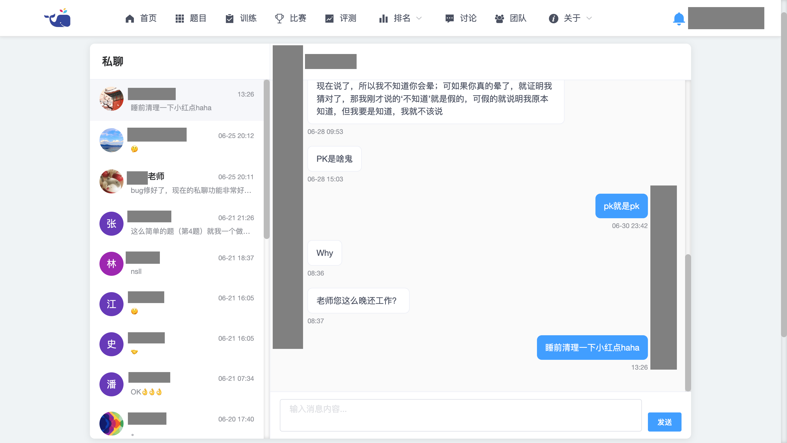
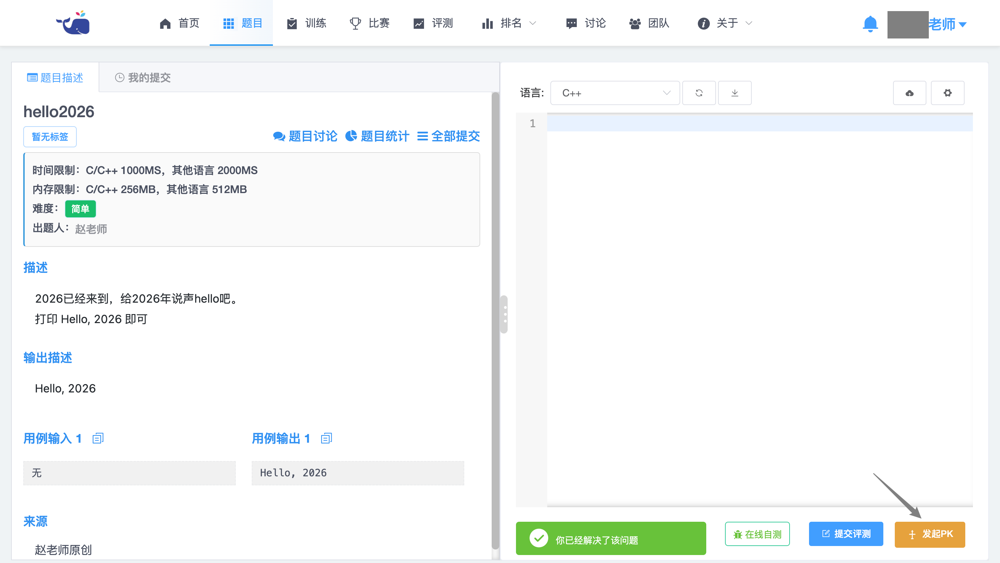
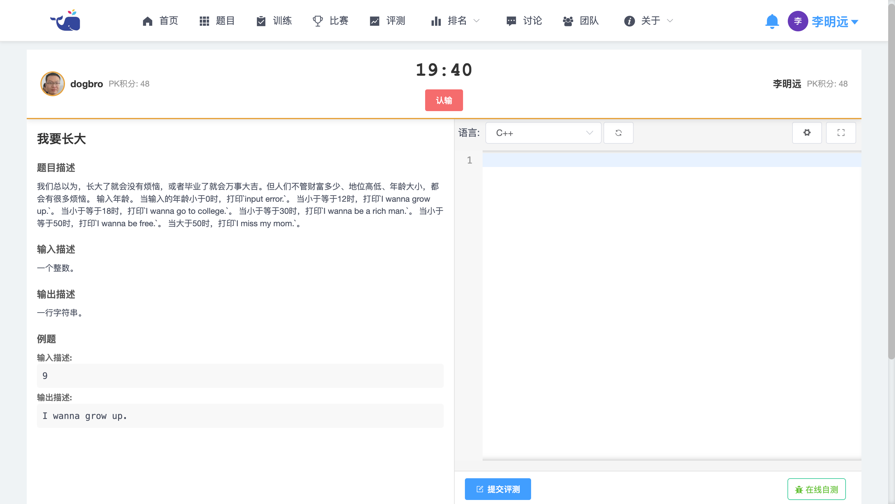
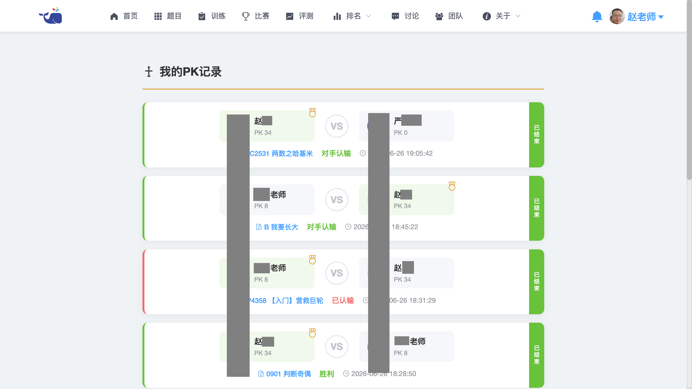

# Hcode Online Judge（HOJ）

> **JXXOJ** — 基于 [HimitZH/HOJ](https://github.com/HimitZH/HOJ) 的二次开发（Fork）版本，由 [lzdogbro](https://github.com/lzdogbro) 维护。


[](http://openjdk.java.net/)
[](https://spring.io/projects/spring-boot)
[](https://spring.io/projects/spring-cloud-alibaba)
[](https://www.mysql.com/)
[](https://redis.io/)
[](https://github.com/alibaba/nacos)
[](https://cn.vuejs.org/)
[](https://github.com/HimitZH/HOJ)
[](https://gitee.com/himitzh0730/hoj)
[](https://qm.qq.com/cgi-bin/qm/qr?k=WWGBZ5gfDiBZOcpNvM8xnZTfUq7BT4Rs&jump_from=webapi)

简体中文 | [English](./README-EN.md)

## 一、项目简介

HOJ 是一个基于 Vue 和 Spring Boot、Spring Cloud Alibaba 构建的**前后端分离、分布式架构**的在线评测系统（Online Judge）。

本项目（JXXOJ）是 HOJ 的 **Fork 二次开发版本**，由 [lzdogbro](https://github.com/lzdogbro) 在原版 [HimitZH/HOJ](https://github.com/HimitZH/HOJ) 的基础上进行功能增强与维护。在保留原版所有功能的同时，新增了 PK 对战、私聊系统等特色功能，并进行了多项优化与问题修复。

### 核心特性

**原版功能：**
- **多语言支持**：支持 C、C++、C#、Python、PyPy、Go、Java、JavaScript、PHP、Ruby、Rust 等多种编程语言的评测
- **Remote Judge（远程评测）**：支持 HDU、POJ、Codeforces（含 GYM）、AtCoder、SPOJ、LIBRE 的远程评测
- **多端适配**：支持 PC 端和移动端浏览，拥有讨论区与站内消息系统
- **训练 & 团队**：支持私有训练、公开训练（题单）和团队协作功能
- **丰富的评测模式**：普通测评、特殊测评（SPJ）、交互测评、在线自测、子任务分组评测、文件 IO
- **完善的比赛系统**：支持 ACM/OI 赛制，支持打星队伍、关注队伍、外榜、滚榜等功能

**二次开发新增：**
- **⚡ PK 对战**：实时 1v1 编程对战，积分排名系统，支持邀请、倒计时、认输、对战历史
- **💬 私聊系统**：用户间一对一私信交流，联系人列表，未读消息提醒
- **📚 题单系统**：训练模块重构为「题单」，支持公开/私有题单、密码访问、分类管理与搜索
- **📝 论坛系统**：讨论区重构为「论坛」，引入帖子概念，帖子可关联题目，支持点赞、举报与后台管理
- **🎓 作业功能**：课程作业的发布与提交，支持学生组管理、时间窗约束、AC 制完成判定
- **🚀 一键部署脚本**：自定义 `deploy.sh`，支持构建 → 打包 → 部署全流程自动化
- **🌐 多语言扩展**：新增繁体中文（zh-TW）、日语（ja-JP）、韩语（ko-KR）国际化支持
- **🐳 CDN 迁移**：静态资源 CDN 迁移至 Cloudflare / jsdelivr，提升国内访问速度
- **🐛 Bug 修复**：修复 Redis 分布式锁问题、PK 对战死锁等关键 bug
- **🎨 品牌更新**：JXXOJ 品牌标识，鲸小小图标替换，关于页面更新

|               在线 Demo               |                   在线文档                   |            仓库地址             |           QQ 群           |
| :--------------------------------: | :--------------------------------------: | :--------------------------------------: | :---------------------: |
| [https://hdoi.cn](https://hdoi.cn) | [https://docs.hdoi.cn](https://docs.hdoi.cn) | [GitHub](https://github.com/HimitZH/HOJ)  ·  [Gitee](https://gitee.com/himitzh0730/hoj) | 598587305（已满） · 743568562 |

### 注意事项

1. **建议使用 CentOS 8 以上或 Ubuntu 16.04 以上的操作系统**，否则判题机（JudgeServer）可能无法正常启动。
2. **若必须使用 CentOS 7 系统**，部署前请先阅读文档说明：[https://docs.hdoi.cn/deploy/faq/](https://docs.hdoi.cn/deploy/faq/)
3. **服务器配置建议 2 核 4G 以上**，以保证服务的正常启动与运行。
4. **尽量避免使用突发性能或共享型云服务器实例**，可能造成评测时间计量不准确。
5. 有任何部署问题或项目 bug 请发 issue 或者加 QQ 群。
6. 如果要对本项目进行商业化，请在页面底部的 Powered by 指向 HOJ 本仓库地址，顺便点个 star 收藏本项目，谢谢支持。

---

## 二、部署指南

这一章讲清楚怎么把 JXXOJ 跑起来。**先花 10 秒判断你属于哪种情况**，再按对应步骤走即可。

### 2.0 两种部署场景

| | 场景 A：本机 / 开发机 | 场景 B：云端生产机 |
|---|---|---|
| 机器上有什么 | 源码 + Docker | 只有部署包目录（**没有源码、没有 deploy.sh**） |
| 什么时候用 | 改完代码想立刻跑起来看效果 | 正式上线、或换一台干净机器部署 |
| 用什么 | `deploy.sh` | `build-cloud-bundle.sh`（本地打包）→ 上传 → `docker compose up -d --build` |

---

### 2.1 环境准备

| 依赖 | 要求 | 什么时候需要 |
|---|---|---|
| Docker | 20.10+ | 两个场景都要 |
| Docker Compose | v2（`docker compose`） | 两个场景都要 |
| JDK + Maven | JDK 8+、Maven 3.6+ | 仅场景 A（本机构建） |
| Node.js | ≥ 17 | 仅场景 A（构建前端，需 `--openssl-legacy-provider`） |

> 系统建议 CentOS 8+ / Ubuntu 16.04+，配置 2 核 4G 以上。判题机（JudgeServer）对内核较敏感，内核过老可能无法启动。

---

### 2.2 场景 A：本机部署（deploy.sh）

**一条命令搞定首次部署：**

```bash
./deploy.sh deploy   # = build（构建）→ init（初始化目录）→ sync（同步产物）→ up（启动容器）
```

完成后访问 `http://localhost:8003`。

**命令速查表：**

| 命令 | 作用 |
|---|---|
| `./deploy.sh deploy`（默认） | 完整流程：构建 → 初始化 → 同步 → 启动 |
| `./deploy.sh build` | 仅构建后端 JAR + 前端 dist |
| `./deploy.sh init` | 初始化 myhoj-deploy 目录结构 |
| `./deploy.sh sync` | 仅同步构建产物到 myhoj-deploy |
| `./deploy.sh up` | 仅启动容器 |
| `./deploy.sh down` | 仅停止容器 |
| `./deploy.sh restart` | 重启容器（down + up，含重新构建） |
| `./deploy.sh status` | 查看容器状态 |
| `./deploy.sh judgeserver` | 仅热替换 JudgeServer JAR（不重建镜像，适合只改判题逻辑时快速生效） |

**可选环境变量：**

```bash
export MYHOJ_DEPLOY_DIR=/path/to/myhoj-deploy         # 部署目录（默认 ../myhoj-deploy）
export BACKEND_JAR_NAME=hoj-backend-4.6.jar           # 后端 JAR 名
export JUDGE_SERVER_JAR_NAME=hoj-judgeServer-4.6.jar  # 判题 JAR 名
```

---

### 2.3 场景 B：云端生产部署（自包含部署包）

云端机器只有 `myhoj-deploy` 目录，**没有源码、没有 deploy.sh**。部署分三步：本地打包 → 改配置 → 云端一条命令启动。

**第 1 步（本地）：打包**

```bash
./build-cloud-bundle.sh              # 完整：生成目录 + 复制数据 + 打 tarball
./build-cloud-bundle.sh --no-tar     # 只生成目录，不打包
./build-cloud-bundle.sh --skip-data  # 跳过数据目录复制（云端自行恢复数据）
```

脚本做了什么：
1. 在 `../myhoj-deploy-cloud` 生成全新的自包含目录（**不会碰你现有的 `myhoj-deploy`**，有路径安全检查）；
2. 同步后端 jar、判题 jar（→ `app.jar`）、前端 dist、滚榜、`hoj.sql`、表结构迁移脚本；
3. 复制 `hoj/` 数据目录（用 `sudo cp -a` 保留属主/权限，mysql 数据目录对 owner 敏感）；
4. 打包成 `../myhoj-deploy-cloud.tar.gz`。

**第 2 步（本地）：改密码**

打开 `myhoj-deploy-cloud/standAlone/.env`，把占位的密钥改成真实值：
- `JWT_TOKEN_SECRET` / `JUDGE_TOKEN`
- `MYSQL_ROOT_PASSWORD` / `REDIS_PASSWORD` / `NACOS_PASSWORD`

**第 3 步（云端）：上传 + 一条命令部署**

```bash
tar xzf myhoj-deploy-cloud.tar.gz
cd myhoj-deploy-cloud/standAlone
docker compose up -d --build
```

这一条命令会自动完成：
- build 后端 / 前端 / 判题机 / 迁移容器；
- MySQL 就绪后**自动应用表结构迁移**（只改结构、不碰数据）。

---

### 2.4 部署包目录结构

```
myhoj-deploy/
├── standAlone/             # 单机部署（一台机器跑全部服务）
│   ├── docker-compose.yml
│   └── .env                # 密码 / token 在这里改
├── distributed/            # 分布式部署（主服务与判题机分离）
├── src/                    # 各容器的构建上下文
│   ├── backend/            # 后端
│   ├── frontend/           # 前端 nginx
│   ├── judgeserver/        # 判题机（远程基础镜像 + 二开 jar）
│   ├── mysql/              # MySQL（含 hoj.sql 初始化）
│   ├── mysql-checker/      # 表结构迁移容器
│   └── rsync/              # 评测数据同步
└── hoj/                    # 数据持久化目录（testcase / file / mysql / judge）
```

---

### 2.5 端口对照

| 服务 | 宿主端口 | 容器端口 | 说明 |
|---|---|---|---|
| 前端 Nginx | 8003 | 80 | 网站入口 |
| 后端 API | 6688 | 6688 | DataBackend |
| 判题机 | 8088 | 8088 | JudgeServer |
| MySQL | 3391 | 3306 | |
| Nacos | 8849 | 8848 | |
| Redis | 6380 | 6379 | |

---

### 2.6 数据库迁移（重要）

升级到含 PK / 私聊 / 作业功能的版本，需要执行两张增量脚本：
- `sqlAndsetting/hoj-pk-chat-update.sql` —— PK 对战 + 私聊
- `sqlAndsetting/hoj-assignment-update.sql` —— 作业功能（7 张新表 + judge 表加 aid 列）

**迁移特点：**
- **幂等**：脚本是 `CREATE TABLE IF NOT EXISTS` + 查 `information_schema` 的存储过程，重复执行也安全；
- **只改结构、不碰数据**：迁移脚本带安全护栏，一旦含 `DROP TABLE` / `TRUNCATE` / `DELETE` / `INSERT` / `UPDATE` 会直接拒绝执行；
- **自动执行**：场景 A 由 `deploy.sh` 自动应用，场景 B 由 `hoj-mysql-checker` 容器在 MySQL 就绪后自动应用；手动升级请按上面顺序依次 source。

---

### 2.7 常见问题

| 现象 | 原因 | 处理 |
|---|---|---|
| 访问报 502，日志里 `connect() failed (111: Connection refused) while connecting to upstream http://127.0.0.1:8003` | 前端容器没起来（8003 无监听） | `docker compose ps -a` 看前端状态，`docker compose logs hoj-frontend` 看报错；常见是 build 失败或 8003 被占用 |
| 提交全部 "Submitted Failed"，但每个测试点都 AC | Lombok ≥1.16.20 反序列化 bug（已修复） | 确认根目录 `lombok.config` 有 `lombok.anyConstructor.addConstructorProperties = true` |
| 判题报 `test case has not found` | 题目测试数据文件丢失 | 见 `docs/作业功能设计.md` 与数据备份 |

---

### 附：官方部署方式（不含二开功能）

如果只想跑原版 HOJ（不含 PK / 私聊 / 作业等二开功能），也可直接用官方 hoj-deploy 仓库：

- 部署文档：[https://docs.hdoi.cn/deploy/docker](https://docs.hdoi.cn/deploy/docker)
- 部署仓库：[https://gitee.com/himitzh0730/hoj-deploy](https://gitee.com/himitzh0730/hoj-deploy)

> ⚠️ 官方 hoj-deploy 使用官方 Docker 镜像，**不包含**二开功能。要用二开版本，请走上面的场景 A / B。

---

## 三、二次开发新增功能详情

### PK 对战（1v1 实时编程对战）

两个用户在同一道题目上进行限时编程对战（20 分钟），先通过评测（AC）者获胜。支持：

- **快速邀请**：在题目页面邀请其他用户进行 PK 对战
- **实时对战页**：左右分屏，左侧题目描述，右侧在线编辑器，顶部实时倒计时
- **积分系统**：胜者 +10 分，败者 -2 分，平局积分不变，积分展示在用户主页
- **历史记录**：查看个人所有 PK 对战历史，包括胜负详情和积分变化
- **计时与超时**：20 分钟倒计时，超时自动判为平局
- **认输机制**：支持主动认输，实时结束对战

### 私聊系统（用户间即时通讯）

用户之间可以进行一对一私信交流，与站内消息系统互补。支持：

- **联系人列表**：自动显示曾有过对话的用户，展示最后一条消息和未读计数
- **实时消息**：发送和接收私聊消息，通过轮询自动刷新
- **未读提醒**：导航栏「私聊」未读时闪烁，并交替显示发送者用户名
- **便捷操作**：回车直接发送、Shift+回车换行，消息内容保留换行
- **便捷入口**：可在用户主页直接发起私聊

### 题单系统（训练模块重构）

原「训练」模块重构为「题单」，作为导航「练习」下拉下的核心模块，支持：

- **公开 / 私有题单**：私有题单需密码访问
- **分类与搜索**：题单分类管理、关键词搜索
- **题单详情**：题单编号、简介、权限、排序
- **后台管理**：创建 / 编辑 / 删除题单，管理题单题目列表

### 论坛系统（讨论区重构）

原「讨论区」重构为「论坛」，以「帖子」为核心组织内容：

- **帖子发布**：帖子可关联题目 ID（如 `P1000`），形成题目讨论
- **互动**：帖子点赞、评论、回复
- **内容治理**：帖子举报、后台论坛管理（查看 / 删除）
- **灵活开关**：后台可配置是否开启比赛论坛区

### 作业功能

导航栏新增「作业」入口（路由 `/assignment`），用于课程作业的发布与提交。已完成学生端前后端与提交判定链路，管理端目前提供后端 API（前端管理界面待后续阶段）。

- **学生端**：作业列表、作业详情（标题、必做/选做、起止时间、进度条）、作业题目列表（每题 AC 状态）、作业内提交
- **完成判定**：AC 制——作业内题目通过评测即计为完成，完成快照在作业发布时定格，不随后续提交回写
- **时间窗**：起止时间动态推导（未开始 / 进行中 / 已结束），不引入定时任务
- **管理端（后端 API）**：学生组管理（增删改查、添加/移除成员）、作业管理（增删改查、发布、延期）
- **权限隔离**：root 全局可见、admin 仅见自己创建的作业、problem_admin 只读

> 📌 **已完成**：阶段 3 导航栏角标 + 未完成数闪烁通知（未完成数轮询接口 `/api/get-assignment-unfinished-count`）。
>
> 📌 **待做**：阶段 4 微信接口与家长绑定（详见 `docs/作业功能设计.md`）。

> 📌 **提示**：升级到包含 PK、私聊、作业功能的版本需要执行数据库增量脚本 `sqlAndsetting/hoj-pk-chat-update.sql`（PK 对战 + 私聊）与 `sqlAndsetting/hoj-assignment-update.sql`（作业功能，新增 7 张表 + judge 表 aid 列）。使用 `deploy.sh` 部署时会自动应用；手动升级请自行按顺序执行。

---

## 四、项目结构

```
HOJ/
├── hoj-springboot/          # 后端 Spring Boot 微服务
│   ├── api/                 # 公共 API 模块（实体类、通用工具）
│   ├── DataBackup/          # 核心业务模块（数据服务）
│   └── JudgeServer/         # 判题服务（沙箱评测）
├── hoj-vue/                 # 前端 Vue 项目
├── hoj-scrollBoard/         # 滚榜独立页面
├── sqlAndsetting/           # 数据库脚本与配置文件
├── docs/                    # 文档源文件
└── sandbox/                 # 判题沙箱相关
```

---

## 五、更新日志

| 时间         | 内容                                       | 更新者           |
| ---------- | ---------------------------------------- | ------------- |
| 2020-10-26 | 正式开发                                     | Himit_ZH      |
| 2021-04-10 | 首次上线测试                                   | Himit_ZH      |
| 2021-04-15 | 判题调度 2.0 解决并发问题                            | Himit_ZH      |
| 2021-04-16 | 重构解耦 JudgeServer 判题逻辑，添加部署文档               | Himit_ZH      |
| 2021-04-19 | 加入 rsync 实现评测数据同步，修复一些已知的 BUG               | Himit_ZH      |
| 2021-04-24 | 加入题目模板，修改页面页脚                            | Himit_ZH      |
| 2021-05-02 | 修复比赛后管理员重判题目导致排行榜失效的问题                   | Himit_ZH      |
| 2021-05-09 | 添加公共讨论区，题目讨论区，比赛评论                       | Himit_ZH      |
| 2021-05-12 | 添加评论及回复删除，讨论举报，调整显示时间                    | Himit_ZH      |
| 2021-05-16 | 完善权限控制，讨论管理员管理，讨论删除与编辑更新                 | Himit_ZH      |
| 2021-05-22 | 更新 docker-compose 一键部署，修正部分 bug             | Himit_ZH      |
| 2021-05-24 | 判题调度乐观锁改为悲观锁                             | Himit_ZH      |
| 2021-05-28 | 增加导入导出题目，增加用户页面的最近登录，开发正式结束             | Himit_ZH      |
| 2021-06-02 | 大更新，完善补充前端页面，修正判题等待超时时间，修补一系列 bug         | Himit_ZH      |
| 2021-06-07 | 修正特殊判题，增加前台 i18n                          | Himit_ZH      |
| 2021-06-08 | 添加后台 i18n，路由懒加载                           | Himit_ZH      |
| 2021-06-12 | 完善比赛赛制，具体请看在线文档                          | Himit_ZH      |
| 2021-06-14 | 完善后台管理员权限控制，恢复 CF 的 vjudge 判题                | Himit_ZH      |
| 2021-06-25 | 丰富前端操作，增加 POJ 的 vjudge 判题                    | Himit_ZH      |
| 2021-08-14 | 增加 SPJ 对 testlib 的支持                       | Himit_ZH      |
| 2021-09-21 | 增加比赛打印功能、账号限制功能                          | Himit_ZH      |
| 2021-10-05 | 增加站内消息系统——评论、回复、点赞、系统通知的消息，优化前端          | Himit_ZH      |
| 2021-10-06 | 美化比赛排行榜，增加对 FPS 题目导入的支持                    | Himit_ZH      |
| 2021-12-09 | 美化比赛排行榜，增加外榜、打星队伍、关注队伍的支持                | Himit_ZH      |
| 2022-01-01 | 增加公开训练和公开训练（题单）                          | Himit_ZH      |
| 2022-01-04 | 增加交互判题、重构 JudgeServer 的三种判题模式（普通、特殊、交互）    | Himit_ZH      |
| 2022-01-29 | 重构 Remote Judge，增加 AtCoder、SPOJ 的支持         | Himit_ZH      |
| 2022-02-19 | 修改首页前端布局和题目列表页                           | Himit_ZH      |
| 2022-02-25 | 支持 PyPy2、PyPy3、JavaScript V8、JavaScript Node、PHP | Himit_ZH      |
| 2022-03-12 | 后端接口全部重构，赛外榜单增加缓存                        | Himit_ZH      |
| 2022-03-28 | 合并冷蕴提交的团队功能                              | Himit_ZH、冷蕴   |
| 2022-04-01 | 正式上线团队功能                                 | Himit_ZH、冷蕴   |
| 2022-05-29 | 增加在线调试、个人主页提交热力图                         | Himit_ZH      |
| 2022-08-06 | 增加题目标签的分类管理（二级标签）                        | Himit_ZH      |
| 2022-08-21 | 增加人工评测、取消评测                              | Himit_ZH      |
| 2022-08-30 | 增加 OI 题目的 subtask、ACM 题目的'遇错止评'模式            | Himit_ZH      |
| 2022-10-04 | 增加比赛奖项配置，增加 ACM 赛制的滚榜                      | Himit_ZH      |
| 2022-11-14 | 增加题目详情页专注模式，优化首页布局                       | Himit_ZH      |
| 2023-05-01 | 增加题目评测支持文件 IO                             | Himit_ZH      |
| 2023-06-11 | 增加允许比赛结束后提交                              | Himit_ZH      |
| 2023-06-27 | 支持 Ruby、Rust                              | Himit_ZH      |
| 2024-03-13 | 支持 LibreOJ 的远程评测                           | Himit_ZH、Nine |
| 2025-06-25 | 增加实名认证相关的邮件发送功能                           |             |
| 2026-06-03 | **Fork到JXXOJ**：对HOJ进行二次开发                     |  lzdogbro   |
| 2026-06-10 | **新增私聊功能**：用户间一对一私信交流，联系人列表，未读消息提醒       |  lzdogbro   |
| 2026-06-18 | **新增 PK 对战功能**：1v1 实时编程对战，限时 20 分钟，积分排名系统   |  lzdogbro   |
| 2026-09-02 | **题单/论坛重构**：训练改名题单（公开/私有、密码、分类），讨论区改名论坛（帖子、关联题目、举报），导航新增作业入口，私聊未读闪动优化 |  lzdogbro   |
| 2026-09-03 | **作业功能**：学生组管理、作业发布/提交链路、AC 制完成判定（学生端前后端 + 管理端后端 API）；deploy.sh 支持多数据库迁移与 JudgeServer 热替换 |  lzdogbro   |
| 2026-09-03 | **云端自包含部署**：build-cloud-bundle.sh 一键打包部署包，judgeserver/mysql-checker 纳入 compose 本地构建，数据库迁移只改结构不碰数据 |  lzdogbro   |

---

## 六、部分截图

**以下截图页面均支持中英文国际化，点击底部的转换即可全网站切换，包括后台管理，同时浏览器会记住本次选择的语言。**

### 1. 首页

> 首页页面


> 首页英文


### 2. 站内消息

> 站内消息系统


### 3. 题目

> 题目列表页


> 题目详情页


### 4. 训练

> 训练列表页


> 训练题目列表页


### 5. 比赛

> 比赛列表页


**比赛以西南科技大学某届新生赛截图为例**

> 比赛详情首页


> 比赛题目列表页


> 比赛排行榜

- ACM 比赛

  

- OI 比赛

  

- 滚榜

  

### 6. 评测

> 提交列表页


### 7. 排行榜

> 排行榜


### 8. 团队

> 团队列表页


> 团队题目列表页


### 9. 讨论

> 公共讨论区


> 评论组件


### 10. 个人主页

> 个人首页


> 个人设置页


### 11. 管理后台

> 管理后台首页


### 12. 手机端

> 部分手机端显示


### 13. 私聊系统（新增 🆕）



### 14. PK 对战（新增 🆕）

> PK 对战页面：左右分屏（题目 + 编辑器），顶部显示双方玩家信息与倒计时




> PK 历史记录：查看个人所有对战记录，包括胜负详情和积分变化



## 七、参与贡献

欢迎提交 Issue 和 Pull Request！如有任何问题，欢迎联系我（狗哥 lzzhaoning@163.com）,感谢您的关心。

**致谢**：本项目基于 [HimitZH/HOJ](https://github.com/HimitZH/HOJ) 进行二次开发，感谢 [HimitZH](https://github.com/HimitZH) 提供的优秀原项目，以及所有贡献者的辛勤付出。
